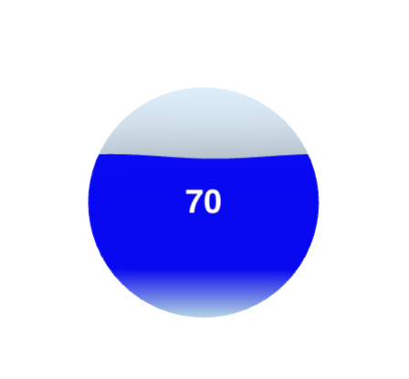

# Liquid Fill extension for Qlik Sense

This extension was developed using Nebulajs and React to add a liquid fill effect to a circular geometric shape in Qlik Sense.

## How to use / install

1. Add the extension to your Qlik Sense environment. (ZIP file inside cluster-liquid-fill-ext)
2. Add a measure that represents the fill percentage.
3. Add the extension to your Qlik Sense application.

## How to develop

1. Clone the repository.
2. Run npm install to install the dependencies.
3. Run npm run start to start the development server.
4. As with any Qlik extension using Nebula.js, set up the necessary variables to connect to your Qlik tenant.
5. Make the necessary changes (supports hot reload).
6. Run npm run sense && npm run build to generate the final build.
7. Compress the files inside the 'cluster-liquid-fill-ext' folder and add them to your Qlik Sense environment.

## Como contribuir

1. Clone the repository.
2. Create an issue describing the feature you want to add.
3. Create a branch with the name of the issue you created.
4. Make the necessary changes.
5. Open a Pull Request from this branch.
7. Wait for the owner's review.
8. After the review, the PR will be merged or rejected.